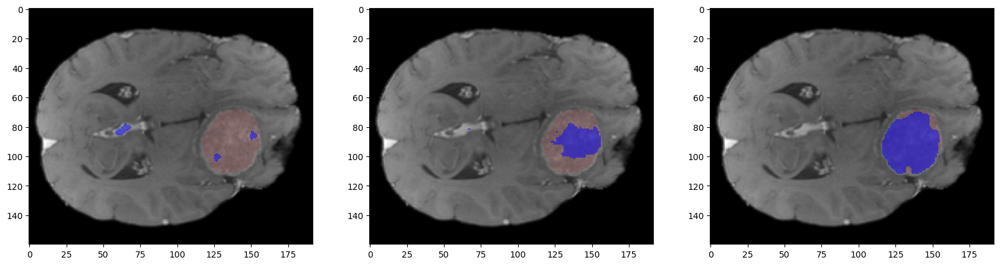

## Brain segmentation project

Model comparison with UNet, UNet++, UNet++ w Deep Supervision, SwinUNETR for 2D mmeningioma segmentation.


Run training with:

```source run/run{0,1,LG}.sh```

 for different network architectures.

 To get performance statistics, run  ```source run/val0.sh``` to extract predicted masks, and then run ```source run/val1.sh``` to get metrics.

 The actual processing is in files ```run/main.py``` and ```run/trainer.py```.

